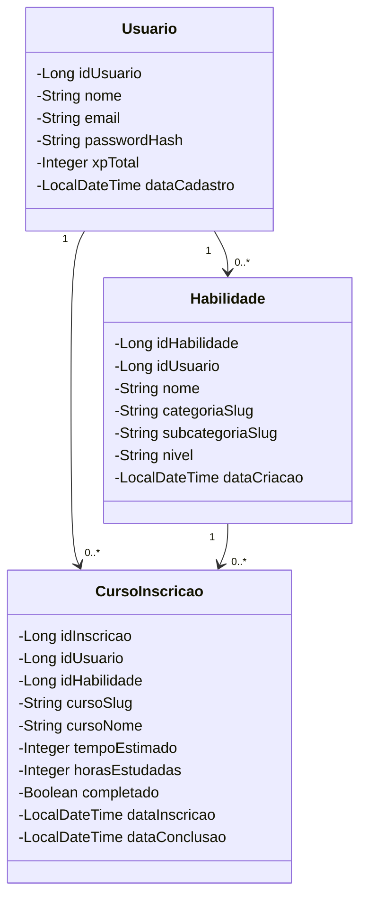

# Diagrama de Classes - Backend Java
## Catálogo de Habilidades - Global Solution 2025

Sistema REST API desenvolvido em **Java 21** com **Jersey 3.1.3** (JAX-RS).

---

## Diagrama de Classes (Mermaid)

---

## Descrição das Classes

### 📦 **Pacote: com.catalogo.habilidades.model (Entidades do Domínio)**

#### **Usuario**
Classe de domínio que representa um usuário do sistema.

**Atributos:**
- `idUsuario`: Identificador único (gerado pelo banco)
- `nome`: Nome completo do usuário
- `email`: E-mail único para login
- `passwordHash`: Hash bcrypt da senha
- `xpTotal`: Total de experiência acumulada do usuário
- `dataCadastro`: Data/hora do cadastro (auto-gerado)

**Responsabilidades:**
- Encapsular dados do usuário
- Garantir inicialização da data de cadastro e XP inicial (0)

#### **Habilidade**
Classe de domínio que representa uma habilidade cadastrada pelo usuário.

**Atributos:**
- `idHabilidade`: Identificador único (gerado pelo banco)
- `idUsuario`: Referência ao usuário que cadastrou
- `nome`: Nome da habilidade
- `categoriaSlug`: Slug da categoria (ex: "programacao", "front-end")
- `subcategoriaSlug`: Slug da subcategoria (ex: "java", "react")
- `nivel`: Nível de proficiência (ex: "iniciante", "intermediario", "avancado")
- `dataCriacao`: Data/hora de criação (auto-gerado)

**Responsabilidades:**
- Encapsular dados da habilidade
- Manter relacionamento com usuário
- Armazenar classificação por categoria/subcategoria e nível

#### **CursoInscricao**
Classe de domínio que representa uma inscrição de usuário em um curso da Alura.

**Atributos:**
- `idInscricao`: Identificador único (gerado pelo banco)
- `idUsuario`: Referência ao usuário inscrito
- `idHabilidade`: Referência à habilidade relacionada
- `cursoSlug`: Slug do curso da Alura
- `cursoNome`: Nome do curso
- `tempoEstimado`: Tempo estimado de conclusão (horas)
- `horasEstudadas`: Horas já estudadas pelo usuário
- `completado`: Flag indicando se curso foi concluído
- `dataInscricao`: Data/hora da inscrição (auto-gerado)
- `dataConclusao`: Data/hora de conclusão (null se não concluído)

**Métodos auxiliares:**
- `getProgressoPercentual()`: Calcula progresso percentual (horasEstudadas / tempoEstimado * 100)

**Responsabilidades:**
- Encapsular dados da inscrição em curso
- Rastrear progresso do usuário
- Calcular percentual de conclusão

---

**Versão:** 3.0  
**Data:** Novembro 2025  
**Projeto:** Global Solution 2025 - FIAP  
**Entidades do Model:** Usuario, Habilidade, CursoInscricao  
**Banco de Dados:** Oracle Database (FIAP)
