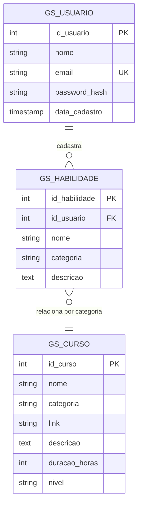

# Diagrama Entidade-Relacionamento (ER)
## Catálogo de Habilidades - Global Solution 2025

Sistema para cadastro de habilidades e sugestão de cursos da Alura relacionados ao tema **"O Futuro do Trabalho"**.

---

## Diagrama ER Visual (Mermaid)



---

## Entidades

### 1. **GS_USUARIO**
Representa os usuários cadastrados no sistema.

| Atributo       | Tipo            | Descrição                          | Restrições           |
|----------------|-----------------|-------------------------------------|----------------------|
| id_usuario     | NUMBER          | Identificador único do usuário     | PK, AUTO_INCREMENT   |
| nome           | VARCHAR2(100)   | Nome completo do usuário           | NOT NULL             |
| email          | VARCHAR2(100)   | E-mail do usuário                  | NOT NULL, UNIQUE     |
| password_hash  | VARCHAR2(255)   | Hash da senha (bcrypt)             | NOT NULL             |
| data_cadastro  | TIMESTAMP       | Data/hora do cadastro              | DEFAULT CURRENT_TIMESTAMP |

**Índices:**
- `idx_usuario_email` em `email`

---

### 2. **GS_HABILIDADE**
Representa as habilidades cadastradas pelos usuários.

| Atributo       | Tipo            | Descrição                          | Restrições           |
|----------------|-----------------|-------------------------------------|----------------------|
| id_habilidade  | NUMBER          | Identificador único da habilidade  | PK, AUTO_INCREMENT   |
| id_usuario     | NUMBER          | Usuário que cadastrou              | FK (GS_USUARIO)      |
| nome           | VARCHAR2(100)   | Nome da habilidade                 | NOT NULL             |
| categoria      | VARCHAR2(50)    | Categoria da habilidade            | NOT NULL             |
| descricao      | CLOB            | Descrição detalhada                |                      |

**Índices:**
- `idx_habilidade_categoria` em `categoria`
- `idx_habilidade_nome` em `nome`
- `idx_habilidade_usuario` em `id_usuario`

**Relacionamentos:**
- `id_usuario` → `GS_USUARIO.id_usuario` (ON DELETE SET NULL)

---

### 3. **GS_CURSO**
Representa os cursos disponíveis (simulação da Alura).

| Atributo       | Tipo            | Descrição                          | Restrições           |
|----------------|-----------------|-------------------------------------|----------------------|
| id_curso       | NUMBER          | Identificador único do curso       | PK, AUTO_INCREMENT   |
| nome           | VARCHAR2(200)   | Nome do curso                      | NOT NULL             |
| categoria      | VARCHAR2(50)    | Categoria do curso                 | NOT NULL             |
| link           | VARCHAR2(500)   | URL do curso                       |                      |
| descricao      | CLOB            | Descrição do curso                 |                      |
| duracao_horas  | NUMBER          | Duração em horas                   |                      |
| nivel          | VARCHAR2(20)    | Nível do curso                     | CHECK (Iniciante, Intermediário, Avançado) |

**Índices:**
- `idx_curso_categoria` em `categoria`
- `idx_curso_nome` em `nome`

---

## Relacionamentos

### Relacionamento Direto (FK)
- **GS_HABILIDADE** → **GS_USUARIO**
  - Tipo: N:1 (muitas habilidades para um usuário)
  - Cardinalidade: Um usuário pode cadastrar várias habilidades
  - FK: `id_usuario` em GS_HABILIDADE referencia `id_usuario` em GS_USUARIO
  - Regra: ON DELETE SET NULL (habilidades ficam órfãs se usuário for excluído)

### Relacionamento Indireto (via categoria)
- **GS_HABILIDADE** ↔ **GS_CURSO**
  - Tipo: N:M (muitas habilidades podem ter muitos cursos relacionados)
  - Cardinalidade: Uma habilidade pode estar relacionada a vários cursos, e um curso pode ser recomendado para várias habilidades
  - Ligação: através do campo `categoria` (sem FK física, relacionamento lógico)
  - Uso: Quando o usuário cadastra uma habilidade, o sistema busca cursos com a mesma categoria para recomendação

---

## Diagrama Visual Alternativo (ASCII)

```
┌──────────────────────────────┐
│       GS_USUARIO             │
├──────────────────────────────┤
│ 🔑 id_usuario (PK)           │
│    nome                      │
│ 🔒 email (UNIQUE)            │
│    password_hash             │
│    data_cadastro             │
└──────────────────────────────┘
              │
              │ 1:N (cadastra)
              │
              ▼
┌──────────────────────────────┐           ┌──────────────────────────────┐
│     GS_HABILIDADE            │           │        GS_CURSO              │
├──────────────────────────────┤           ├──────────────────────────────┤
│ 🔑 id_habilidade (PK)        │           │ 🔑 id_curso (PK)             │
│ 🔗 id_usuario (FK)           │           │    nome                      │
│    nome                      │  N:M      │    categoria                 │
│    categoria ────────────────┼──────────►│    link                      │
│    descricao                 │ (lógico)  │    descricao                 │
└──────────────────────────────┘           │    duracao_horas             │
                                            │    nivel                     │
                                            └──────────────────────────────┘

Legenda:
🔑 = Primary Key (PK)
🔗 = Foreign Key (FK)
🔒 = Unique Constraint
```

---

## Categorias Suportadas

As seguintes categorias são utilizadas no sistema:

- **Tecnologia**: Java, Python, React, JavaScript, Node.js, etc.
- **Design**: UX Design, UI Design, Figma, Adobe XD, etc.
- **Soft Skill**: Comunicação, Liderança, Oratória, Trabalho em Equipe, etc.
- **Negócios**: Gestão de Projetos, Metodologias Ágeis, Estratégia, etc.
- **Marketing**: Marketing Digital, SEO, Redes Sociais, Analytics, etc.

---

## Regras de Negócio

1. **Usuário único**: Cada e-mail pode ser cadastrado apenas uma vez (constraint UNIQUE)
2. **Habilidade órfã**: Se um usuário for excluído, suas habilidades ficam com `id_usuario = NULL` (ON DELETE SET NULL)
3. **Relacionamento por categoria**: Cursos são sugeridos automaticamente com base na categoria da habilidade
4. **Níveis de curso**: Apenas três níveis permitidos: Iniciante, Intermediário ou Avançado (validado por CHECK constraint)
5. **Autenticação segura**: Senhas armazenadas apenas como hash bcrypt (gerado pelo backend Java)
6. **Timestamp automático**: Data de cadastro é definida automaticamente no momento da inserção

---

## Queries de Relacionamento

### Buscar cursos relacionados a uma habilidade específica:
```sql
SELECT 
    h.nome AS habilidade,
    h.categoria,
    c.nome AS curso_recomendado,
    c.link,
    c.nivel,
    c.duracao_horas
FROM GS_HABILIDADE h
INNER JOIN GS_CURSO c ON h.categoria = c.categoria
WHERE h.id_habilidade = ?
ORDER BY c.nivel, c.nome;
```

### Listar habilidades de um usuário com contagem de cursos disponíveis:
```sql
SELECT 
    h.nome AS habilidade,
    h.categoria,
    COUNT(c.id_curso) AS total_cursos_disponiveis
FROM GS_HABILIDADE h
LEFT JOIN GS_CURSO c ON h.categoria = c.categoria
WHERE h.id_usuario = ?
GROUP BY h.id_habilidade, h.nome, h.categoria
ORDER BY total_cursos_disponiveis DESC;
```

### Buscar cursos por categoria com filtro de nível:
```sql
SELECT 
    c.nome AS curso,
    c.categoria,
    c.nivel,
    c.duracao_horas,
    c.link
FROM GS_CURSO c
WHERE c.categoria = 'Tecnologia'
  AND c.nivel = 'Iniciante'
ORDER BY c.nome;
```

---

## Observações Técnicas

- **SGBD**: Oracle Database (11g ou superior)
- **Sequences**: Utiliza `GENERATED ALWAYS AS IDENTITY` para auto-incremento (Oracle 12c+)
- **Segurança**: Senhas hash bcrypt com salt (implementado no backend Java com biblioteca bcrypt 0.4)
- **Performance**: Índices estratégicos em email, categoria e campos de busca frequente
- **Escalabilidade**: Relacionamento lógico N:M evita tabela intermediária, simplificando queries
- **Integridade**: Constraints de FK garantem consistência referencial

---

## Conexão com o Tema: "O Futuro do Trabalho"

Este sistema está alinhado ao tema porque:

- ✅ Incentiva o **aprendizado contínuo** (reskilling e upskilling)
- ✅ Ajuda pessoas a encontrarem cursos para se adaptarem ao mercado
- ✅ Conecta habilidades com oportunidades de aprendizado
- ✅ Suporta empresas na recomendação de cursos para funcionários

### Alinhamento com ODS:
- **ODS 4:** Educação de qualidade
- **ODS 8:** Trabalho decente e crescimento econômico
- **ODS 9:** Inovação e infraestrutura

---

**Versão:** 2.0  
**Data:** Novembro 2025  
**Projeto:** Global Solution 2025 - FIAP  
**Tema:** O Futuro do Trabalho
